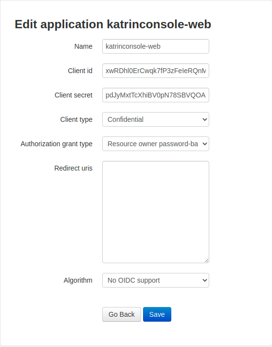

# Frequently Asked Questions

## Q1. How does Authentication and Authorization work?

Identity Server: OAuth 2.0 + Django Auth App (models + permissions)

## Q2. How to add a new route?

URL routing is mixed between server and client. Some routes are provided by the
'admin' or the 'oauth' apps. First we match the requested URL on the server side,
if not matched then there is a default server route that map routing to the client
side.

```python
urlpatterns = [
    # server side routing including API endpoints
    path('admin/', admin.site.urls),
    path('api/', include('rest_framework.urls')),
    path('o/', include('oauth2_provider.urls', namespace='oauth2_provider')),
    ....
    # map to client side routing
    re_path(r'^.*$', home),
] 
```

Server side routing is managed through django framework default routing. While
client-side routing is done using React Router v5.x (`react-router-dom` package:
https://reactrouter.com/web/api/)

## Q3. How to add a new OAuth application?

1. Go to `localhost:8000/o/applications/` 
2. Create a new application of the attributes in the image below (do not modify client ID and client secret):
3. Save and use the generated client id and client secret for `OAUTH_CLIENT_ID` and `OAUTH_CLIENT_SECRET` respectively.


